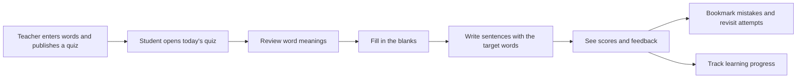
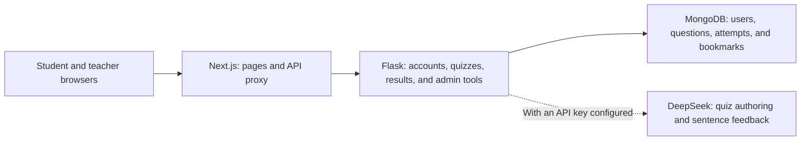

# Lexilab Alpha

**English** · [简体中文](README.zh-CN.md) · [繁體中文](README.zh-TW.md)

Before the major rebuild of 词源通 (LexiLamp), I built an English-practice platform around daily quizzes. Teachers entered vocabulary and published quizzes; students reviewed meanings, filled in blanks, wrote their own sentences, and revisited their scores and mistakes. This repository preserves that earlier chapter.


| Quiz library | Review word meanings |
| --- | --- |
|  |  |

| Fill in the blanks | Review an attempt |
| --- | --- |
|  |  |

| Learning progress | Teacher tools |
| --- | --- |
|  |  |

These screens were captured in a local browser with fictional accounts. No real student records are included.

## A practice session, from start to finish



Each quiz has three stages: vocabulary review, fill-in-the-blanks, and sentence writing. Students can save their place, then see their scores, AI feedback, and earlier attempts after submitting. Teachers can manage users, word pools, quizzes, and statistics.

## How the pieces fit together



`frontend/` contains the Next.js 16, React 19, and TypeScript pages; `backend/` contains the Flask API. MongoDB stores users, quizzes, attempts, and bookmarks. The AI integration is optional: without a provider key, you can still browse the demo quizzes and existing results, but live generation and grading will not work.

## Run it locally

You will need Node.js, Python 3.11+, and a MongoDB instance listening only on your machine. The commands below use PowerShell; keep the frontend and backend in separate terminals.

1. Copy `.env.example` to `.env`. Generate a random `SECRET_KEY` and point `MONGO_URI` at your local MongoDB. To load the sample data, set `MONGO_DB_NAME=lexilab_alpha_demo` and choose a `DEMO_PASSWORD` of at least 12 characters. Do not commit `.env`.
2. Install and start the backend:

   ```powershell
   python -m venv .venv
   .\.venv\Scripts\python.exe -m pip install -r backend\requirements.txt
   .\.venv\Scripts\python.exe demo\seed.py
   cd backend
   ..\.venv\Scripts\python.exe app.py
   ```

3. Start the frontend in another terminal:

   ```powershell
   cd frontend
   npm ci
   npm run dev
   ```

Open `http://127.0.0.1:3000`. The demo accounts are `demo_learner` and `demo_teacher`; both use the `DEMO_PASSWORD` you set in `.env`. The seed script accepts only a loopback MongoDB connection and the `lexilab_alpha_demo` database, and creates only fictional users, quizzes, and results. To try live AI grading, set `DEEPSEEK_API_KEY` separately.

## What this archive keeps

- The student's quiz, review, bookmark, progress, and profile screens, plus the teacher's quiz and user-management screens.
- Flask endpoints for authentication, word pools, quizzes, results, statistics, and AI features.
- A repeatable fictional-data seed script for recreating the main README screens.

I rebuilt this public copy from an old server archive. It does not include the old Git history, environment files, runtime logs, databases, student records, or downloaded dependencies. During the cleanup, I removed hard-coded credential fallbacks and request-header logging, closed a draft-quiz access bypass, and added login checks to results, progress, bookmarks, and AI requests.

This is a snapshot of the 2025 quiz phase and a look back at where LexiLamp began. Some older pages still have TypeScript type errors, so the build currently skips type checking; automated tests and deployment safeguards are also incomplete. It is best suited to local exploration and code review, not direct use as a live teaching system.
