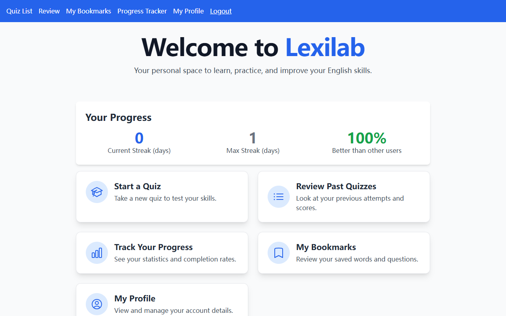
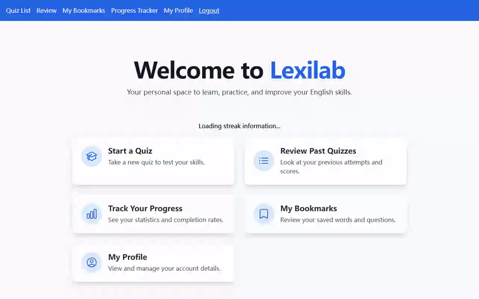
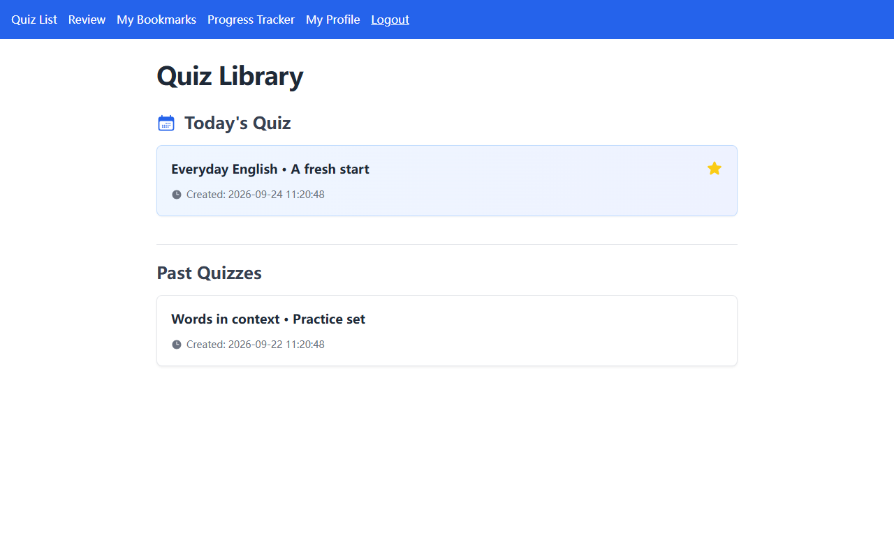
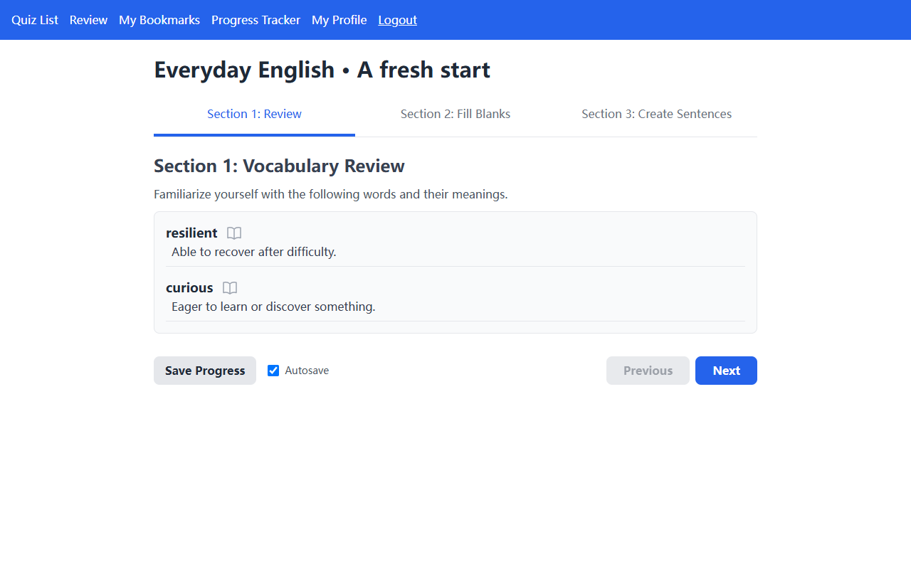
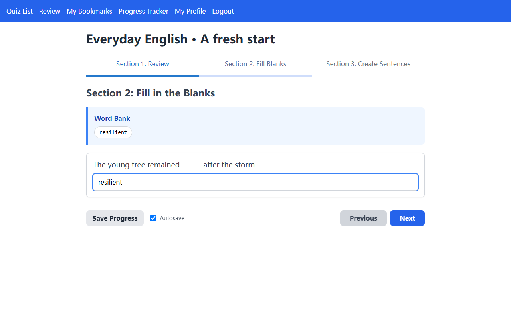
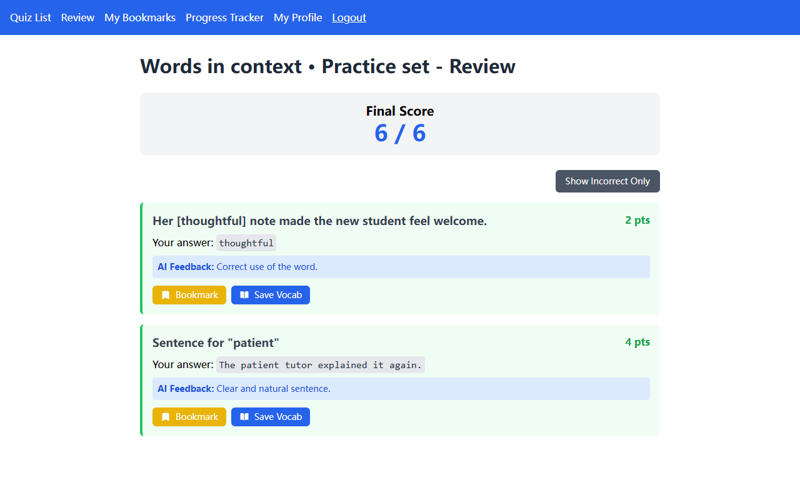
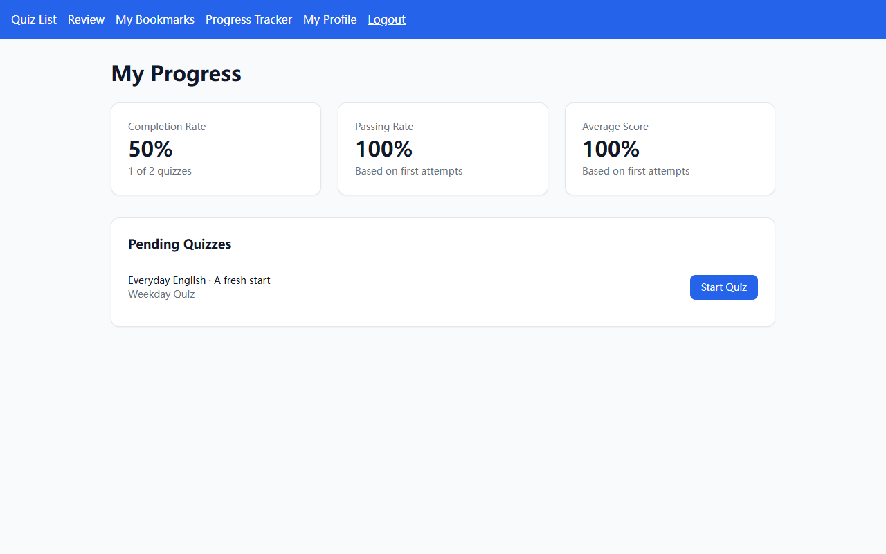
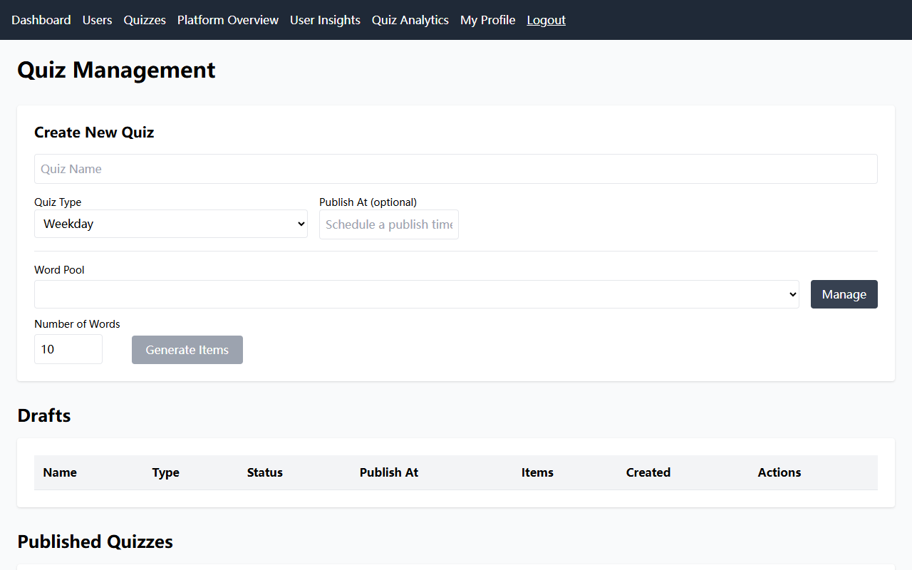
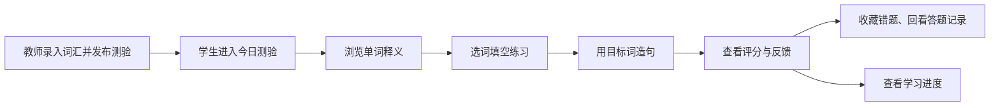
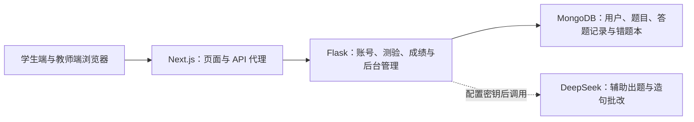

# Lexilab Alpha

词源通（LexiLamp）重做之前，我把英语练习做成过一个每日 quiz 平台。教师录入词汇并发布测验；学生从词义预习开始，接着填空、造句，最后回看成绩和错题。这个仓库保存的就是那一阶段的代码。





| 测验库 | 先看词义 |
| --- | --- |
|  |  |

| 填空练习 | 答题回顾 |
| --- | --- |
|  |  |

| 学习进度 | 教师管理 |
| --- | --- |
|  |  |

上面的画面来自本地浏览器和虚构账号；仓库没有收录真实学生记录。

## 一次练习是怎样完成的



测验分为词义预习、填空和造句三段。学生可以中途保存，提交后查看分数、AI 反馈与历史尝试；管理员可以管理用户、词池、测验以及统计页面。

## 它是怎样连接起来的



`frontend/` 是 Next.js 16、React 19 和 TypeScript 页面；`backend/` 是 Flask API。MongoDB 保存用户、测验、答题结果和收藏。AI 接口是可选的：没有配置提供商密钥时，页面仍可浏览演示测验与已有结果，实时生成和评分不可用。

## 本地体验

需要 Node.js、Python 3.11+ 和一个仅在本机监听的 MongoDB。以下命令以 PowerShell 为例；前后端各占一个终端。

1. 复制 `.env.example` 为 `.env`，生成随机 `SECRET_KEY`，将 `MONGO_URI` 指向本机 MongoDB。要使用演示数据，请设 `MONGO_DB_NAME=lexilab_alpha_demo`，并填写至少 12 位的 `DEMO_PASSWORD`。不要提交 `.env`。
2. 安装并启动后端：

   ```powershell
   python -m venv .venv
   .\.venv\Scripts\python.exe -m pip install -r backend\requirements.txt
   .\.venv\Scripts\python.exe demo\seed.py
   cd backend
   ..\.venv\Scripts\python.exe app.py
   ```

3. 在另一个终端启动前端：

   ```powershell
   cd frontend
   npm ci
   npm run dev
   ```

打开 `http://127.0.0.1:3000`。演示账号是 `demo_learner` 和 `demo_teacher`，密码是你在 `.env` 中设置的 `DEMO_PASSWORD`。`demo/seed.py` 只接受本机 MongoDB 和 `lexilab_alpha_demo` 数据库，并且使用虚构的用户、测验和成绩。若要体验实时 AI 评分，再单独设置 `DEEPSEEK_API_KEY`。

## 这份归档保留了什么

- 学生的测验、回顾、错题收藏、进度和个人页面，以及教师的测验和用户管理页面。
- Flask 的认证、词池、测验、结果、统计与 AI 接口。
- 一份可重复执行的虚构数据脚本，方便重现 README 中的主要画面。

公开版本从旧服务器归档中重新整理，没有带入旧 Git 历史、环境文件、运行日志、数据库、学生资料或下载的依赖。整理时移除了硬编码凭据回退值、请求头日志和一个未授权查看草稿测验的入口，并为成绩、进度、书签与 AI 请求补上了登录检查。

这是 2025 年 quiz 阶段的作品存档，记录了后来 LexiLamp 的起点。历史页面仍有未补齐的 TypeScript 类型标注，构建暂时跳过类型检查；自动化测试和部署安全也不完整。它适合本地体验与代码回顾，不建议直接作为线上教学系统部署。
