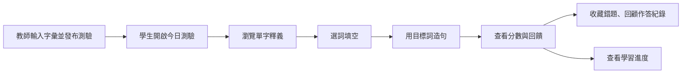
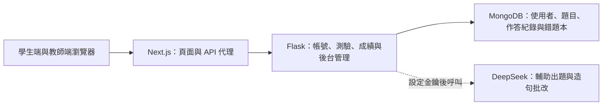

# Lexilab Alpha

[English](README.md) · [简体中文](README.zh-CN.md) · **繁體中文**

這是一個英文測驗練習平台。教師輸入字彙並發布測驗；學生先預習詞義，再填空、造句，最後回顧成績和錯題。專案使用 Next.js、Flask，並以 MongoDB 儲存資料。

後來的重構版本見 [LexilabCode](https://github.com/Hcrab/LexilabCode)；前端從 Next.js 改用 react-scripts。


| 測驗庫 | 查看詞義 |
| --- | --- |
|  |  |

| 填空練習 | 作答回顧 |
| --- | --- |
|  |  |

| 學習進度 | 教師管理 |
| --- | --- |
|  |  |

以上畫面來自本機瀏覽器與虛構帳號；儲存庫沒有收錄真實學生紀錄。

## 練習流程



測驗分為詞義預習、填空和造句三個階段。學生可以中途儲存進度，提交後查看分數、AI 回饋與過往作答；教師可以管理使用者、字彙庫、測驗及統計頁面。

## 專案架構



`frontend/` 包含 Next.js 16、React 19 和 TypeScript 頁面；`backend/` 是 Flask API。MongoDB 儲存使用者、測驗、作答結果與收藏。AI 整合為選用功能：沒有設定供應商金鑰時，仍可瀏覽示範測驗與既有結果，但無法即時生成題目或評分。

## 在本機體驗

需要 Node.js、Python 3.11+，以及只在本機監聽的 MongoDB。以下以 PowerShell 為例；前後端請分別使用一個終端機。

1. 將 `.env.example` 複製為 `.env`，產生隨機 `SECRET_KEY`，並把 `MONGO_URI` 指向本機 MongoDB。若要使用示範資料，請設為 `MONGO_DB_NAME=lexilab_alpha_demo`，並設定至少 12 個字元的 `DEMO_PASSWORD`。不要提交 `.env`。
2. 安裝並啟動後端：

   ```powershell
   python -m venv .venv
   .\.venv\Scripts\python.exe -m pip install -r backend\requirements.txt
   .\.venv\Scripts\python.exe demo\seed.py
   cd backend
   ..\.venv\Scripts\python.exe app.py
   ```

3. 在另一個終端機啟動前端：

   ```powershell
   cd frontend
   npm ci
   npm run dev
   ```

開啟 `http://127.0.0.1:3000`。示範帳號為 `demo_learner` 和 `demo_teacher`，密碼是你在 `.env` 中設定的 `DEMO_PASSWORD`。`demo/seed.py` 只接受本機 MongoDB 與 `lexilab_alpha_demo` 資料庫，並只建立虛構的使用者、測驗和成績。若要體驗即時 AI 評分，再另外設定 `DEEPSEEK_API_KEY`。

## 這份存檔保留了什麼

- 學生端的測驗、回顧、錯題收藏、進度與個人頁面，以及教師端的測驗和使用者管理頁面。
- Flask 的驗證、字彙庫、測驗、結果、統計與 AI 介面。
- 可重複執行的虛構資料腳本，方便重現 README 中的主要畫面。

公開版本從舊伺服器存檔重新整理，沒有帶入舊 Git 紀錄、環境檔案、執行日誌、資料庫、學生資料或下載的依賴套件。整理時移除了寫死的憑證預設值與請求標頭日誌，封閉了未授權查看草稿測驗的入口，並為成績、進度、書籤與 AI 請求補上登入檢查。
